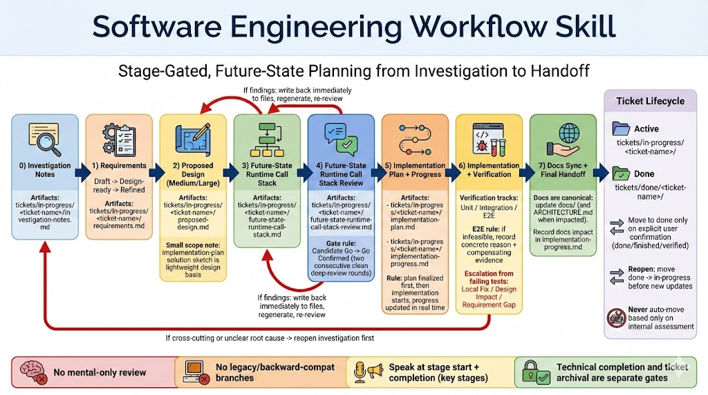
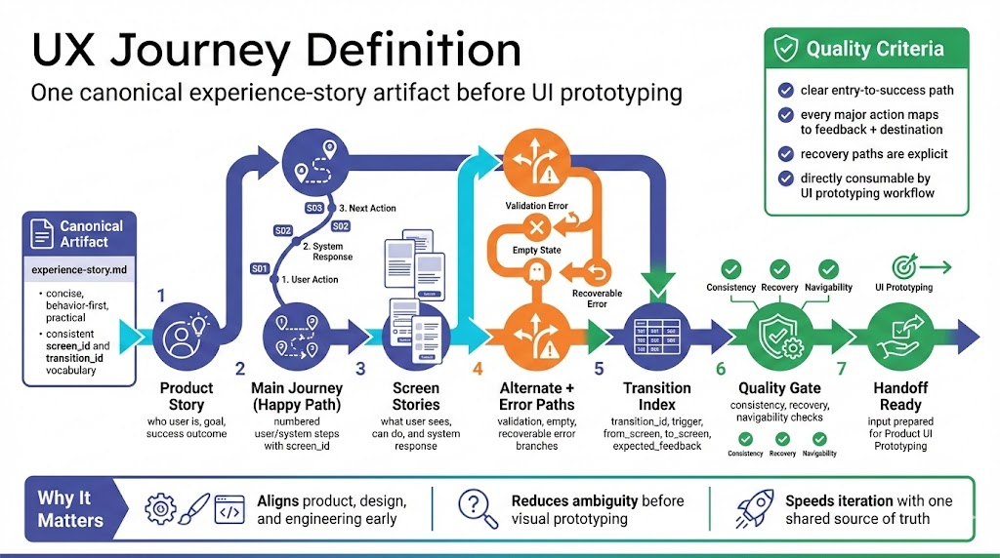
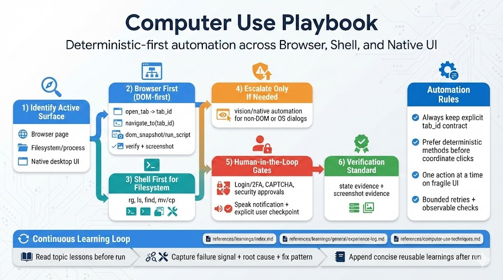

# AutoByteus Skills

This repository contains reusable Codex skills used across AutoByteus projects.

## Skill Infographics

### Software Engineering Workflow Skill

Stage-gated engineering workflow from investigation and requirements to implementation and docs sync.

### Product UI Prototyping

State-by-state UI behavior prototyping workflow with manifest, flow maps, and viewer handoff.

### UX Journey Definition

One canonical experience-story artifact that defines actions, responses, transitions, and recovery paths.

### Computer Use Playbook

Deterministic computer-use workflow across browser DOM actions, shell operations, and native UI escalation.
